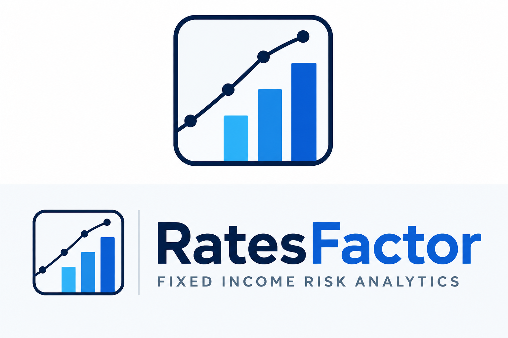

# RatesFactor

RatesFactor answers three practical Treasury risk questions: where does rate exposure live on the curve, does a PCA hedge actually reduce that exposure, and does the hedge still look reasonable after transaction costs, VaR checks, and a mismatched hedge universe.

It is a research-grade fixed-income risk analytics dashboard, not a production pricing system. The focus is the risk workflow: key-rate exposure, PCA factor hedging, hedge stability, scenario/VaR behavior, and transparent model limitations.

## Highlights

- Treasury curve ingestion from FRED constant-maturity Treasury series across 11 tenors, with CMT/par-yield history converted into proxy zero-rate history before downstream risk analytics.
- Pricing curve source can be FRED, a bundled demo curve-construction universe, or a user-uploaded curve-construction universe.
- Portfolio ingestion from a toy portfolio, a standard holdings template, or iShares TLT-style holdings files.
- Settlement-date-aware fixed-rate bond valuation with clean value, dirty value, accrued interest, ACT/ACT support, frequency, and maturity dates.
- Portfolio analytics: market value, weighted average maturity, weighted average coupon, DV01, effective duration, convexity, and line-item bond analytics.
- 11-key-rate DV01 ladder and key-rate concentration diagnostics.
- Rolling 3-factor PCA on Treasury curve changes with cosine-similarity sign/alignment handling.
- Ridge-regularized PCA hedge solve with hedge suitability diagnostics.
- Transaction-cost-aware rolling hedge backtest with gross and net P&L.
- Historical simulation VaR/ES and parametric PCA VaR/ES.
- Historical VaR backtesting with breach counts, breach rates, Kupiec LR statistic, and p-value.
- 21 rate shock scenarios, including Basel/IRRBB-style USD shocks.
- PCA P&L attribution across PC1, PC2, PC3, and residual.
- Visible validation artifacts: linearized-vs-full-reprice attribution error, pricing caveats, and lightweight unit tests.

## Development Note

The core analytics code was written by me, including the bond pricer, portfolio data readers, FRED data pull, yield-curve fitting, zero-curve bootstrapper, PCA engine, hedge construction, hedge backtests, VaR/ES, VaR backtesting, and P&L attribution. I used Claude as an engineering assistant for the Streamlit app layer and visualization code. The dashboard design, UI decisions, feature choices, and implementation direction were still mine; the AI assistance was used to speed up presentation, wiring, and deployment work around the fixed-income engine.

## How This Was Built

The project started as a set of research notebooks where I hand-derived the PCA hedge solve, tested the bond-pricing and key-rate ladder mechanics, and then refactored the working pieces into a Python package plus a Streamlit dashboard. The fixed-income methodology was built around Treasury cash-flow pricing, DV01/key-rate exposure, rolling PCA factor extraction, ridge-regularized least-squares hedging, historical/parametric VaR, Kupiec backtesting, and scenario stress testing; the handwritten hedge derivation is included here: [pca-hedge-derivation.pdf](docs/proof-of-work/pca-hedge-derivation.pdf). I used Python, pandas, NumPy, scikit-learn, SciPy, Plotly, Streamlit, and FRED data, with AI coding assistance used mainly to speed up app wiring, visualization formatting, documentation cleanup, and deployment workflow.

## Dashboard

Run the Streamlit app locally:

```bash
pip install -r requirements.txt
streamlit run streamlit_app.py
```

The dashboard requires a FRED API key. Use either a local Streamlit secrets file:

```toml
# .streamlit/secrets.toml
FRED_API_KEY = "your_key_here"
```

or an environment variable:

```bash
export FRED_API_KEY="your_key_here"
```

Do not commit `.streamlit/secrets.toml`.

The hosted dashboard opens in **Fast demo** mode by default. That mode loads a precomputed default toy-portfolio run from `assets/demo_run.pkl`, so reviewers can see the full dashboard without waiting for the rolling hedge backtest and VaR tables to recompute. Switch to **Custom run** in the sidebar to run the full pipeline from selected inputs. To refresh the bundled demo artifact locally:

```bash
python scripts/build_demo_run.py
```

## Project Structure

```text
RatesFactor/
├── streamlit_app.py
├── requirements.txt
├── README.md
├── docs/
│   ├── METHODOLOGY.md
│   ├── ASSUMPTIONS_AND_LIMITATIONS.md
│   ├── DESIGN_DECISIONS.md
│   ├── FUTURE_SCOPE.md
│   ├── PROOF_OF_WORK.md
│   └── proof-of-work/
│       ├── pca-hedge-derivation.pdf
│       └── prototype-notebooks/
├── scripts/
│   └── build_demo_run.py
└── ratesfactor/
    ├── attribution.py
    ├── bootstrapper.py
    ├── config.py
    ├── curves.py
    ├── data.py
    ├── hedging.py
    ├── pca.py
    ├── plots.py
    ├── portfolio.py
    ├── pricing.py
    ├── risk.py
    ├── scenarios.py
    ├── templates.py
    ├── zerocurve.py
    └── var.py
```

## Portfolio Inputs

The app supports three portfolio modes:

- **Toy portfolio**: built-in 2Y, 5Y, 10Y, and 30Y Treasury example.
- **Standard holdings template**: user-supplied Excel file with description, par value, coupon, maturity, frequency, settlement date, and day count.
- **TLT-style holdings file**: iShares-style holdings CSV cleaned into Treasury bond rows.

Custom hedge instruments can also be uploaded through a hedge-instruments template.

## Curve Construction Inputs

The app supports three pricing-curve modes:

- **FRED CMT-implied zero curve**: default mode that converts FRED constant-maturity/par-yield history into proxy periodic zero rates.
- **Filled demo bootstrap template**: bundled dummy curve-construction universe for showing the bootstrapping workflow.
- **Uploaded curve construction universe**: user downloads the template, fills in prices/terms, and uploads it back into the app.

The curve construction template keeps the essential fields: instrument ID/type, settlement date, maturity date, coupon, coupon frequency, day count, face value, clean price, accrued interest, dirty price, quote date, and notes.

## Modeling Scope

RatesFactor focuses on Treasury curve risk:

- Yield curve shape and PCA factors.
- DV01/key-rate DV01 exposure.
- PCA-based hedge construction.
- Hedge stability diagnostics.
- Scenario shocks and VaR/ES.
- Transaction-cost-aware backtesting.

The pricing engine is intentionally simplified compared with institutional systems. FRED mode converts CMT/par-yield history into proxy periodic zero rates before pricing and risk; the bootstrapped modes demonstrate curve construction from a template universe but are still research-grade, not a full production Treasury curve build. When rates are used directly for bond cash-flow discounting, the app uses periodic compounding based on the instrument coupon frequency:

```text
DF(t) = 1 / (1 + r / frequency)^(frequency * t)
```

In the bundled demo curve-construction universe, comparing fitted/par-yield proxy pricing with the bootstrapped curve gives an average absolute difference of about **$2.48 per $100 face** across the toy 2Y/5Y/10Y/30Y bonds, with the largest difference about **$6.54 per $100 face** on the 30Y bond. This is a demo-universe sensitivity check, not a universal pricing-error estimate.

How that comparison is constructed:

- **Fitted/par-yield proxy price:** coupon bonds use their coupon rates as par-yield-style curve points; bills are converted into simple discount-implied rates. Those rates are interpolated across the toy bond maturities and used to discount the toy portfolio cash flows.
- **Bootstrapped price:** the same curve-construction universe is bootstrapped into discount factors from dirty prices. Bills give direct discount factors; coupon bonds are solved in maturity order after discounting earlier coupons with already-known discount factors. Toy portfolio cash flows are then discounted from the resulting zero curve.
- **Reported difference:** price per $100 face under the bootstrapped curve minus price per $100 face under the fitted/par-yield proxy curve.

## Validation

The repo includes lightweight tests for:

- Flat-curve/par-ish bond pricing.
- Accrued interest between coupon dates.
- Positive DV01 sign for long fixed-rate Treasury-like bonds.
- The demo pricing-error comparison helper.

Run locally:

```bash
pytest -q
```

## Documentation

- [Methodology](docs/METHODOLOGY.md)
- [Assumptions and Limitations](docs/ASSUMPTIONS_AND_LIMITATIONS.md)
- [Design Decisions](docs/DESIGN_DECISIONS.md)
- [Future Scope](docs/FUTURE_SCOPE.md)
- [Proof of Work](docs/PROOF_OF_WORK.md)
- [Credits and References](docs/CREDITS_AND_REFERENCES.md)

## Status

This is a research prototype for Treasury risk analytics. It is not a production-grade pricing, risk, or trading system.
